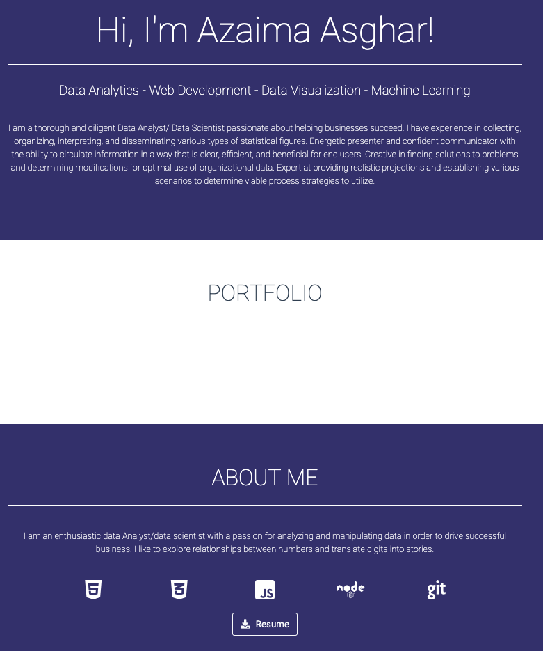
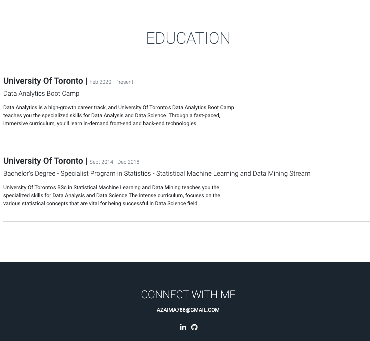

# *Mission-to-Mars-Web-Scraping-with-HTML-CSS*

## *Project Overview*

A junior data scientist Robin, does freelancing astronomy work in her spare time. She spends a lot of time reading articles on mission to Mars. She has an idea, what if she could write a script that would gather all the information she searches for into one convenient location, and once she gathers it, what if she could show it to other astrofiles.

Robin wants to gather data about the mission to mars from all over the web and display it in a central location without spending her free time gathering data manually. Instead she plans to build a web application that will scrap new data every time she tells it with the click of a button.

Before scraping the data Robin needs to understand how web pages are built. In this way she will be able to write a python script that can navigate the web pages to collect the right information. After collecting all the data she will store the data in NoSQL database, the MongoDB since data pulled from the internet is not the neat and tidy table forms that SQL requires.

Finally, Robin will use Flask to put everything together in her web application.

## *Resources*

* Data Source:
    
    * NASA news website:  https://mars.nasa.gov/news/?page=0&per_page=40&order=publish_date+desc%2Ccreated_at+desc&search=&category=19%2C165%2C184%2C204&blank_scope=Latest

    * Mars’ hemispheres: https://astrogeology.usgs.gov/search/results?q=hemisphere+enhanced&k1=target&v1=Mars

* Open-source distribution software Anaconda and the Jupiter notebook.

* Flask.

* MongoDB.

* Splinter, BeautifulSoup, Pandas, datetime libraries for python.

* Visual Studio Code.

## *Results*

The web application can be seen by running the code present in the apps folder located above. 

## *Overview of Portfolio*

